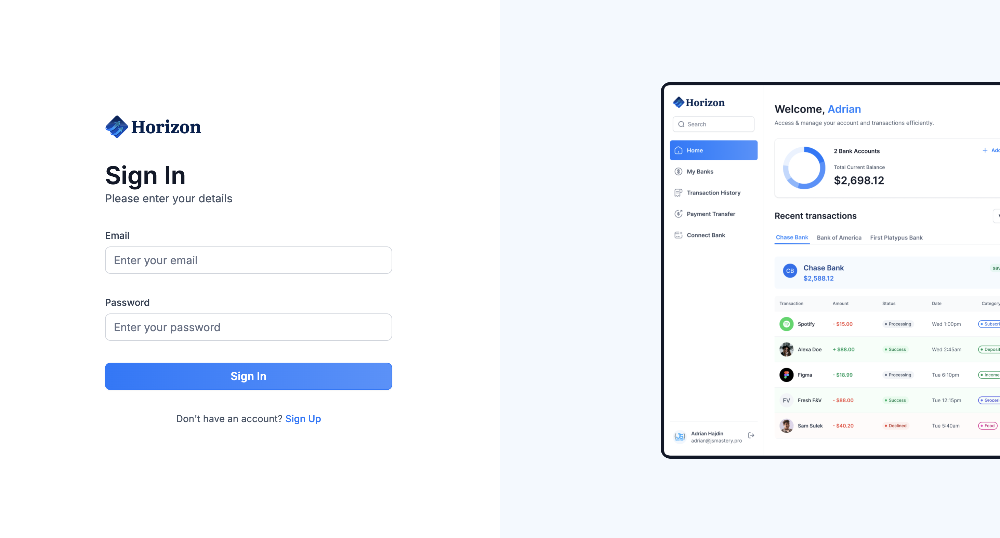

# Secure Banking Application

**Banking App** is a modern web application that allows users to securely connect their bank accounts and perform money transfers.

## Live Demo

Visit the live application at: [https://vinesk-banking.vercel.app/](https://vinesk-banking.vercel.app/)

## Features

- **Account Management**:

  - Secure bank account connection via Plaid
  - Real-time balance and transaction monitoring
  - Analytics dashboard with charts
  - Transaction categorization
  - Multi-bank account support

- **Money Transfers**:
  - Secure transfers via Dwolla
  - Beneficiary management
  - Transfer history
  - Real-time notifications
  - Transaction status tracking

## Tech Stack

**Framework**: Next.js 14  
**UI Components**: Radix UI, Tailwind CSS  
**Database**: Appwrite  
**Banking Services**: Plaid, Dwolla  
**Analytics**: Chart.js  
**Error Tracking**: Sentry  
**Deployment**: Vercel

## Setup

### Frontend

1. Clone the frontend repo:

   ```bash
   git clone https://github.com/vinesk/banking.git
   cd banking
   ```

2. Install dependencies:

   ```bash
   npm install
   ```

3. Create a `.env.local` file based on the following structure:

   ```bash
   # Next.js Configuration
   NEXT_PUBLIC_SITE_URL=your-site-url

   # Appwrite Configuration
   NEXT_PUBLIC_APPWRITE_ENDPOINT=https://cloud.appwrite.io/v1
   NEXT_PUBLIC_APPWRITE_PROJECT=your-project-id
   APPWRITE_DATABASE_ID=your-database-id
   APPWRITE_USER_COLLECTION_ID=your-user-collection-id
   APPWRITE_BANK_COLLECTION_ID=your-bank-collection-id
   APPWRITE_TRANSACTION_COLLECTION_ID=your-transaction-collection-id
   NEXT_APPWRITE_KEY=your-appwrite-api-key

   # Plaid Configuration
   PLAID_CLIENT_ID=your-plaid-client-id
   PLAID_SECRET=your-plaid-secret
   PLAID_ENV=sandbox or development or production
   PLAID_PRODUCTS=auth,transactions
   PLAID_COUNTRY_CODES=US,CA

   # Dwolla Configuration
   DWOLLA_KEY=your-dwolla-key
   DWOLLA_SECRET=your-dwolla-secret
   DWOLLA_BASE_URL=https://api-sandbox.dwolla.com
   DWOLLA_ENV=sandbox

   # Sentry Configuration
   SENTRY_AUTH_TOKEN=your-sentry-auth-token
   ```

4. Start the development server:
   ```bash
   npm run dev
   ```

## Usage

- **Account Connection**: Use Plaid Link to securely connect your bank accounts
- **Dashboard**: View your balances and transactions with interactive charts
- **Transfers**: Perform secure money transfers through the Dwolla interface
- **Analytics**: Track your spending and income with analytical tools

## Security Features

The application implements several security measures:

- Secure authentication via Appwrite
- Encryption of sensitive data
- Integration with certified banking services (Plaid & Dwolla)
- Real-time error monitoring with Sentry
- Secure environment variable management
- HTTPS enforcement

## API Integration

- **Plaid**: Used for bank account connection and transaction fetching
- **Dwolla**: Handles secure money transfers between accounts
- **Appwrite**: Manages user authentication and data storage

## License

ISC License. See the [LICENSE](./LICENSE) file for details.
